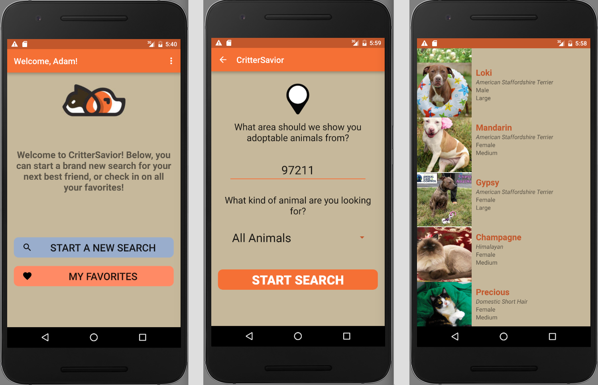
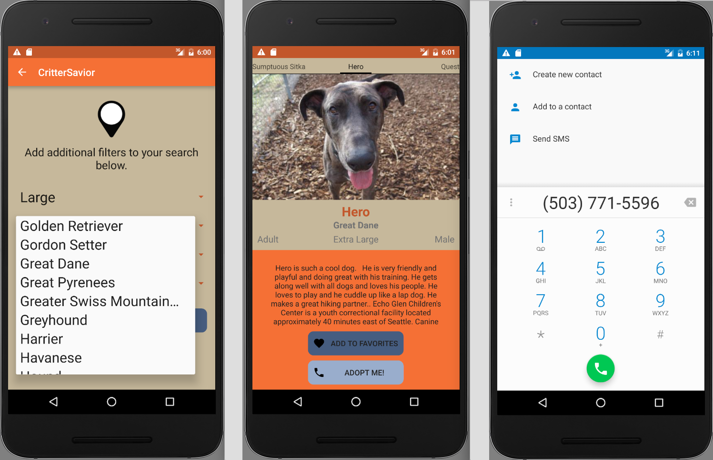

# _CritterSavior_

#### _An Android app that allows users to search for nearby adoptable cats and dogs with a robust set of search options and filters. Users can be as general or specific as they like with their searches, from "Any Animal" to "Medium-Sized Female Senior Golden Retriever"._

#### By _**Adam Craig**_

## Description

_An Android mobile app that empowers users to search for adoptable pets using a wide variety of criteria. Primary search criteria includes zip code and species, but optional search criteria are possible as well such as size, breed and coat color. Users can save search preferences so that they can continuously check in on their area or preferred pets. Users can also populate a Favorites List of pets to keep track of. Each searched pet has their own Pet Profile with detailed information as well as "Add To Favorites" and "Adopt Me" buttons that link to the Favorites List and shelter contact info, respectively._

## Setup/Installation Requirements

* _Ensure that Android Studio is installed on your machine._
* _Using the command line, clone the supreme-invention repository to your desktop using the command "git clone https://github.com/AdamCraig/supreme-invention"_
* _Open the package using Android Studio, choose your emulator, and run the app._

## Known Bugs

_No known bugs at this time._

## Support and contact details

_For all issues and support, please contact:
Adam Craig at ajcraig@suffolk.edu_

## Technologies Used

_Java, Gradle, Android Framework, Android Studio, PetFinder API_

### License

The MIT License (MIT)

Copyright (c) 2016 Adam Craig

Permission is hereby granted, free of charge, to any person obtaining a copy
of this software and associated documentation files (the "Software"), to deal
in the Software without restriction, including without limitation the rights
to use, copy, modify, merge, publish, distribute, sublicense, and/or sell
copies of the Software, and to permit persons to whom the Software is
furnished to do so, subject to the following conditions:

The above copyright notice and this permission notice shall be included in all
copies or substantial portions of the Software.

THE SOFTWARE IS PROVIDED "AS IS", WITHOUT WARRANTY OF ANY KIND, EXPRESS OR
IMPLIED, INCLUDING BUT NOT LIMITED TO THE WARRANTIES OF MERCHANTABILITY,
FITNESS FOR A PARTICULAR PURPOSE AND NONINFRINGEMENT. IN NO EVENT SHALL THE
AUTHORS OR COPYRIGHT HOLDERS BE LIABLE FOR ANY CLAIM, DAMAGES OR OTHER
LIABILITY, WHETHER IN AN ACTION OF CONTRACT, TORT OR OTHERWISE, ARISING FROM,
OUT OF OR IN CONNECTION WITH THE SOFTWARE OR THE USE OR OTHER DEALINGS IN THE
SOFTWARE.
